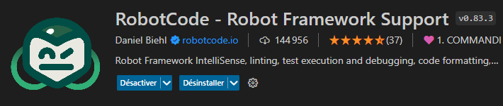

# robot-framework-template

Panduza Robot Template is based on tips from robot framework documentation:

- https://docs.robotframework.org/docs/examples/project_structure

<!-- ---------------------------------------------------------------- -->
<!-- ---------------------------------------------------------------- -->
<!-- ---------------------------------------------------------------- -->

## Directory Map

- tests: put your acceptance tests here (.robot)
- platform: contains changing resource configuration of your project
- report-serve.sh: mount a nginx web server for the robot report on this directory (use docker, easy to use on Linux)

<!-- ---------------------------------------------------------------- -->
<!-- ---------------------------------------------------------------- -->
<!-- ---------------------------------------------------------------- -->

## VsCode Extensions

VsCode has become a very important tools in the software industry. You can use it to build your own Robot Test IDE.

### Robot Code

This extension seems better integrated when you work on Windows (less cofiguration to reach a working point).



<!-- ---------------------------------------------------------------- -->
<!-- ---------------------------------------------------------------- -->
<!-- ---------------------------------------------------------------- -->

## Good Practice

### Use "platform.resource"

This concept allow a better resource management of your test project.

Append all your imports inside a "platform.resource" file, then just import this file in all your tests. (see [platform/template/platform.resource](./platform/template/platform.resource))

Then you just have to import only "platform.resource" (see [tests/test1.robot](./tests/test1.robot))

Moreover, you can create one platform directory for each of your tests configuration. This way you will be able to switch from one to an other thanl to pythonpath.

Here you are using the "template" resources

```json
"robotcode.robot.pythonPath": [
    "${workspaceFolder}/platform/template"
]
```

Here you are using the "demo" resources

```json
"robotcode.robot.pythonPath": [
    "${workspaceFolder}/platform/demo"
]
```

### Gherkin on high level test description (Given, When, Then)

Robot Framework is a great python test framework but Gherkin provide a better test description syntax.

I advice to use it on your high level test descriptions : (see [tests/test2_gherkin.robot](./tests/test2_gherkin.robot))

By the way, if your are not using python on some other project... Go see https://cucumber.io/

